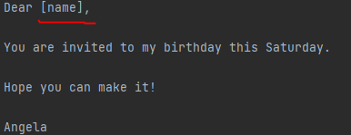
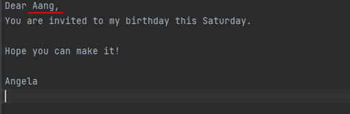

# mail_merge

This program will loop in a list of names from an external file. 
Throughout the list, it will look at a text and replace the string [name] with the final name:

**Before**

**After**

****